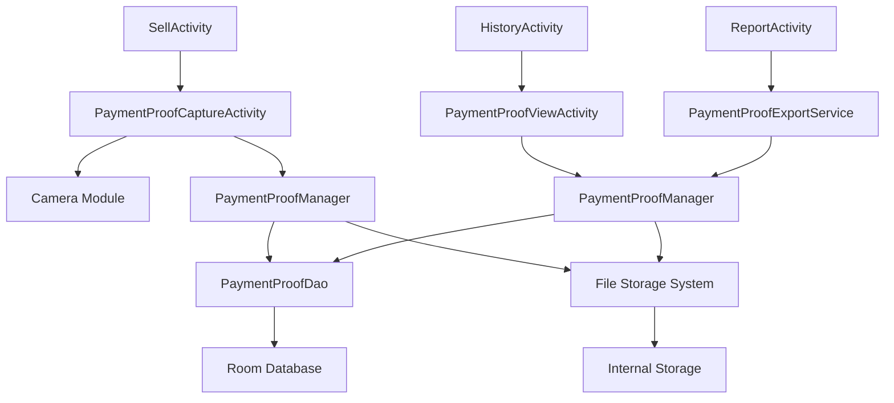

# Design Document: QRIS Payment Proof Feature

## Overview

The QRIS Payment Proof feature extends the existing transaction system to capture, store, and manage photographic evidence of QRIS payments. This feature integrates seamlessly with the current Android application architecture, utilizing the existing camera capabilities and storage systems while adding new data models and UI components specifically for payment proof management.

The design follows the existing application patterns using Java, Android Room database, and the current activity-based architecture. The feature will be implemented as an optional step in the QRIS payment flow, ensuring it doesn't disrupt existing workflows.

## Architecture

### High-Level Architecture



### Integration Points

The feature integrates with existing components:
- **SellActivity**: Modified to include payment proof capture option for QRIS transactions
- **HistoryActivity**: Enhanced to display payment proof indicators and access photos
- **ReportActivity**: Extended to include payment proof export functionality
- **AppDatabase**: Extended with PaymentProof entity and relationships
- **DataRepository**: Enhanced with payment proof operations

## Components and Interfaces

### Core Components

#### PaymentProofManager
```java
public class PaymentProofManager {
    public CompletableFuture<PaymentProof> capturePaymentProof(long transactionId, String paymentMethod);
    public CompletableFuture<PaymentProof> savePaymentProof(long transactionId, Bitmap photo);
    public CompletableFuture<List<PaymentProof>> getPaymentProofsByDateRange(Date start, Date end);
    public CompletableFuture<PaymentProof> getPaymentProofByTransactionId(long transactionId);
    public CompletableFuture<Boolean> deletePaymentProof(long paymentProofId);
    public CompletableFuture<List<PaymentProof>> searchPaymentProofs(String query);
}
```

#### PaymentProofCaptureActivity
```java
public class PaymentProofCaptureActivity extends AppCompatActivity {
    private void initializeCamera();
    private void capturePhoto();
    private void processAndSavePhoto(Bitmap photo);
    private void returnToTransaction(boolean success);
}
```

#### PaymentProofViewActivity
```java
public class PaymentProofViewActivity extends AppCompatActivity {
    private void displayPaymentProof(PaymentProof proof);
    private void enableZoomAndPan();
    private void showTransactionDetails();
    private void sharePaymentProof();
}
```

### Storage Components

#### PaymentProofStorageHelper
```java
public class PaymentProofStorageHelper {
    public String savePhotoToInternalStorage(Bitmap photo, String filename);
    public Bitmap loadPhotoFromInternalStorage(String filepath);
    public boolean deletePhotoFile(String filepath);
    public long getAvailableStorageSpace();
    public List<String> getAllPaymentProofFiles();
}
```

#### ImageCompressionUtil
```java
public class ImageCompressionUtil {
    public static Bitmap compressImage(Bitmap original, int maxWidth, int maxHeight, int quality);
    public static boolean isImageReadable(Bitmap image);
    public static String generateUniqueFilename(long transactionId, Date timestamp);
}
```

## Data Models

### PaymentProof Entity
```java
@Entity(tableName = "payment_proofs")
public class PaymentProof {
    @PrimaryKey(autoGenerate = true)
    private long id;
    
    @ColumnInfo(name = "transaction_id")
    private long transactionId;
    
    @ColumnInfo(name = "file_path")
    private String filePath;
    
    @ColumnInfo(name = "file_name")
    private String fileName;
    
    @ColumnInfo(name = "capture_timestamp")
    private Date captureTimestamp;
    
    @ColumnInfo(name = "file_size")
    private long fileSize;
    
    @ColumnInfo(name = "is_corrupted")
    private boolean isCorrupted;
    
    @ColumnInfo(name = "payment_method")
    private String paymentMethod; // "QRIS"
    
    // Constructors, getters, setters
}
```

### Enhanced CashFlow Entity
The existing CashFlow entity will be extended with:
```java
@ColumnInfo(name = "has_payment_proof")
private boolean hasPaymentProof;

@ColumnInfo(name = "payment_method")
private String paymentMethod; // "CASH", "QRIS"
```

### PaymentProofDao
```java
@Dao
public interface PaymentProofDao {
    @Insert
    long insertPaymentProof(PaymentProof paymentProof);
    
    @Query("SELECT * FROM payment_proofs WHERE transaction_id = :transactionId")
    LiveData<PaymentProof> getPaymentProofByTransactionId(long transactionId);
    
    @Query("SELECT * FROM payment_proofs WHERE capture_timestamp BETWEEN :startDate AND :endDate")
    LiveData<List<PaymentProof>> getPaymentProofsByDateRange(Date startDate, Date endDate);
    
    @Query("SELECT * FROM payment_proofs ORDER BY capture_timestamp DESC")
    LiveData<List<PaymentProof>> getAllPaymentProofs();
    
    @Delete
    void deletePaymentProof(PaymentProof paymentProof);
    
    @Query("UPDATE payment_proofs SET is_corrupted = 1 WHERE id = :id")
    void markAsCorrupted(long id);
}
```

## User Interface Design

### Payment Proof Capture Flow
1. **Transaction Completion**: After QRIS payment, show optional "Foto Bukti Pembayaran" button
2. **Camera Interface**: Full-screen camera with capture button and cancel option
3. **Preview & Confirm**: Show captured photo with save/retake options
4. **Success Feedback**: Brief confirmation message before returning to main flow

### History Integration
1. **Transaction List**: Add camera icon indicator for transactions with payment proof
2. **Transaction Detail**: Show thumbnail of payment proof with tap-to-view option
3. **Full View**: Dedicated activity for viewing payment proof with zoom and transaction details

### Management Interface
1. **Payment Proof Gallery**: Grid view of all payment proof photos
2. **Filter Options**: Date range, transaction amount, payment method filters
3. **Bulk Operations**: Multi-select for delete/export operations

## Error Handling

### Camera Errors
- **Camera Permission Denied**: Show permission request dialog with explanation
- **Camera Hardware Unavailable**: Fallback to gallery selection or skip option
- **Photo Capture Failed**: Retry mechanism with user notification

### Storage Errors
- **Insufficient Storage**: Warning dialog with storage management options
- **File Save Failed**: Retry mechanism and error logging
- **Corrupted File**: Mark as corrupted in database, show placeholder in UI

### Data Integrity
- **Missing Photo Files**: Handle gracefully with placeholder image
- **Database Inconsistency**: Cleanup orphaned records during app startup
- **Backup/Restore Errors**: Validate file integrity and provide recovery options

## Testing Strategy

### Unit Testing
- Test PaymentProofManager operations with mock dependencies
- Test ImageCompressionUtil with various image formats and sizes
- Test PaymentProofDao database operations
- Test file storage operations with mock file system

### Integration Testing
- Test complete payment proof capture flow
- Test payment proof viewing and management
- Test backup and restore operations with payment proofs
- Test error scenarios and recovery mechanisms

### UI Testing
- Test camera integration and photo capture
- Test payment proof display and zoom functionality
- Test navigation between activities
- Test accessibility features

## Correctness Properties

*A property is a characteristic or behavior that should hold true across all valid executions of a system-essentially, a formal statement about what the system should do. Properties serve as the bridge between human-readable specifications and machine-verifiable correctness guarantees.*

### Property 1: Photo Storage Consistency
*For any* captured payment proof photo, the system should save it with proper compression, consistent naming convention (transaction ID + timestamp), and store it in the dedicated payment proof directory while maintaining readability.
**Validates: Requirements 1.3, 2.1, 2.2, 2.3**

### Property 2: Transaction Linkage Integrity
*For any* successfully saved payment proof photo, the system should create and maintain a valid link between the photo and its corresponding transaction record.
**Validates: Requirements 1.4**

### Property 3: File Validation Before Storage
*For any* photo file being stored, the system should validate that it is not corrupted before linking it to a transaction record.
**Validates: Requirements 2.4**

### Property 4: Payment Proof Display Consistency
*For any* transaction that has an associated payment proof photo, the transaction history should display a payment proof indicator.
**Validates: Requirements 3.1**

### Property 5: Management Data Completeness
*For any* payment proof management operation, the system should display all stored payment proof photos with their complete associated transaction data.
**Validates: Requirements 4.1**

### Property 6: Data Consistency on Deletion
*For any* payment proof photo deletion operation, the system should remove both the physical file and update the corresponding transaction record to maintain data consistency.
**Validates: Requirements 4.3, 6.4**

### Property 7: Search and Filter Accuracy
*For any* search or filter operation on payment proof photos, the system should return results that accurately match the specified criteria (date range, transaction amount, etc.).
**Validates: Requirements 4.4**

### Property 8: Export Structure Completeness
*For any* payment proof export operation, the system should create a structured export package that includes both the photos and their complete associated transaction data.
**Validates: Requirements 4.5**

### Property 9: Transaction Flow Integrity
*For any* transaction completion (with or without payment proof capture), the system should maintain all existing transaction functionality and complete the transaction successfully.
**Validates: Requirements 5.4**

### Property 10: Backup and Restore Round-Trip
*For any* set of payment proof photos and their associated transactions, performing a backup followed by a restore should preserve all photos, transaction links, and data integrity.
**Validates: Requirements 6.1, 6.2, 6.3**